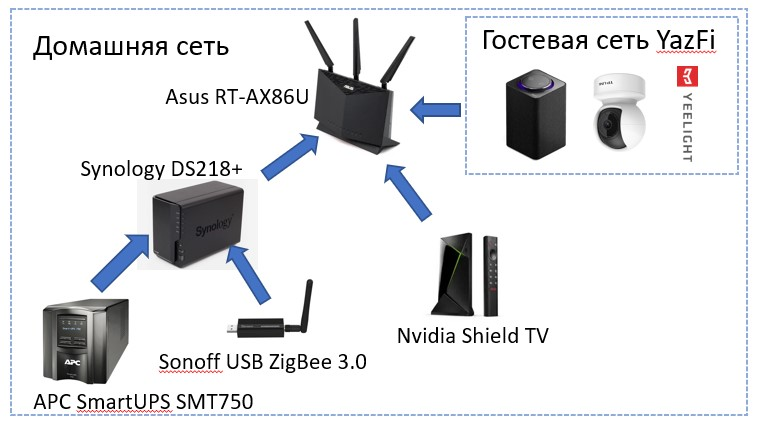
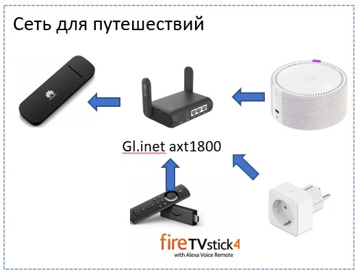
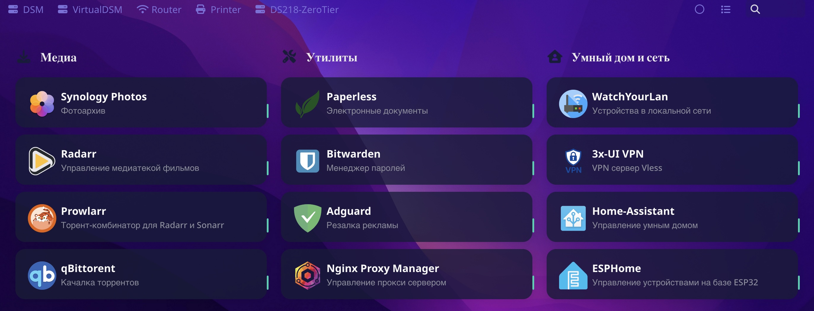

# "Живи с умом!" (c) Смешарики
## Железо

Основа моего умного дома - NAS Synology DS218+, в который я вставил 2 планки старой ноутбучной памяти, тем самым, нарастив её до 16 Гб. В НАСе стоят два Enterpise жестких диска (WD RED, Seagate IronWolf Pro) в режиме зеркала (RAID 0).

НАС - это полноценный домашний сервер. Хранение файлов - только одна из многих его функций. В будущем я (наверное) заменю жесткие диски на SSD чтобы уменьшить шум. Чем НАС лучше одноплатника или NUCа? Софтом для телефона, удобной вебмордой, энергопотреблением. Чем хуже? Нет места для карт расширения.

На роутеры АСУС существует кастомная прошивка от merlin. Туда же через утилиту amtm можно установить аддон YazFi, который немного расширяет управление гостевыми сетями и устройствами. Подробней смотри в папке [ASUS Router](/ASUS Router/README.MD)

Когда мы надолго куда-нибудь уезжаем, я беру с собой "умный дом лайт"

Воткнуть свой роутер в сеть отеля - это удобно. Не нужно подключать планшеты/телефоны/ноутбуки к новому вайфаю, т.к. на роутере настроена домашняя сеть. Быстрый вайфай + встроенный ВПН до дома чтобы, например, скачать кино. Мини Алиса (с USB-c!) и умная розетка позволяют выключать свет не вставая с дивана (супер опция для тех, кто проходил весь день). 
Модем Huawei, даже прошитый хакнутой прошивкой - опция так себе. Как-нибудь проапгрейжу до внешнего кейса + miniPCI WAN карты (на 4pda отличная тема про [это](https://4pda.to/forum/index.php?showtopic=994474))
Роутеры gl.inet - прям отличный девайс! Интерфейс очень понравился, внутри - openwrt. 
Amazon Fire TV 4k Pro - лучший стик, на распродаже оч дёшев. Можно убрать всё гавно от Амазона (см @amazonfiretvrus в телеге), поставить [FLauncher](https://gitlab.com/flauncher/flauncher), [SmartTubeNext](https://github.com/yuliskov/SmartTubeNext), [AerialView](https://github.com/theothernt/AerialViews), NUM - No UI Movies и Kodi

## Софт

Вот так выглядит домашний веб сервер Homer (ниже про него подробней)
На НАСе крутятся:
- Софт Synology
  - Synology Photos - отличный каталогизатор семейных фотографий. Я немного причесываю семейный архив [скриптами](https://github.com/ageev/others) время от времени
  - HyperBackup - универсальный бэкапер. Работает практически со всеми облаками и имеет очень гибкие политики бэкапа. Я бэкаплю много и часто, в основном, в Azure, предварительно всё хорошенько зашифровав
  - CloudSync - синхронизирует локальную папку на НАСе с каким-нибудь облаком
  - Virtual Machine Manager - тут у меня крутится VitrualDSM (виртуальный НАС). Раньше была ещё Убунту, но сейчас всё в докере
  - Surveillance Station - отличный менеджер камер наблюдения
  - НАС шарит папку Media со всей домашней сетью, где лежат скачанные фильмы
- Python скрипты через планировщик
- docker - тут всё самое основное
  - [adguard](https://github.com/ageev/SmartHouse/tree/master/adguard) - продвинутая резалка рекламы. Лучше чем [pihole](https://github.com/ageev/SmartHouse/tree/master/pi-hole)
  - [caddy](https://github.com/ageev/SmartHouse/tree/master/docker/caddy) - вебсервер с поддержкой ACME (автоматическая выдача HTTPS сертификатов) - *заменил на Nginx Proxy Manager + acme.sh*
  - [esphome](https://github.com/ageev/SmartHouse/tree/master/docker/esphome) - генератор прошивок и дэшборд для ESP32 (дешевый чип с поддержкой Wi-Fi и BLE). Позволяет перепрошивать всякие Tuya Smart и прочии девайсы для интеграции с Home Assistant
  - *home-assistant* (HA, homeass, хомяк)- универсальный интеграционный сервис умного дома. За счёт огромного количества аддонов позволяет связывать в единую систему очень разные компоненты. Например, Яндекс Станцию и Телеграм, датчики IKEA и вентилятор Xiaomi. Примеры автоматизаций внутри
  - [homer](https://github.com/ageev/SmartHome/tree/master/docker/homer) - простой вебсервер, на котором удобно сделать стартовую страницу умного дома. Скриншот из Гомера вы видите выше. Когда мне нужно что-то открыть в домашней сети - я использую стартовую страницу Гомера
  - [transmission](https://github.com/ageev/SmartHome/tree/master/docker/transmission) - качалка торрентов. Выбрал её потому что у нее самая удобная интеграция с HA. Использую с плагином для браузера Torrent Control - позволяет скачивать всё сразу на НАС
  - [acme.sh](https://github.com/ageev/SmartHouse/tree/master/acme.sh) - позволяет автоматизировать получение HTTPS сертификатов, посылает уведомоления в телегу, может пушить обновления сразу на НАС
  - [vaultwarden](https://github.com/ageev/SmartHouse/tree/master/vaultwarden) - форк BitWarden - очень хороший менеджер паролей с клиентами под все платформы
  - [nginx proxy manager](https://github.com/ageev/SmartHouse/tree/master/Nginx%20Proxy%20Manager) - единое окно (ну почти) для всех внутренних веб-порталов. Позволяет сделать "зеленый замочек" (HTTP -> HTTPS) там, где его отродясь не было. Один минус NGM - нужно искать уникальный кастомный прокси конфиг под каждое приложение. С Traefik такой проблемы нет. Надо сравнить
  - mariadb - база данных. Нужна для Nginx Proxy Manager
  - [mosquitto](https://github.com/ageev/SmartHome/tree/master/docker/zigbee2mqtt) - MQTT брокер. Нужен для zigbee2mqtt. Работает с очередью запросов к ZigBee устройствам для умного дома
  - [zigbee2mqtt](https://github.com/ageev/SmartHome/tree/master/docker/zigbee2mqtt) - позволяет интегрировать Zigbee устройства умного дома с home-assistant. Работает с USB стиком Sonoff Zigbee 3.0, воткнутым в USB порт НАСа. В целом, можно было использовать и встроенный в Home Assistant zigbee модуль
  - [plex](https://github.com/ageev/SmartHome/tree/master/docker/plex) - каталогизатор видео. Позволяет на лету транскодировать видеопотоки (если железо позволяет. DS218+ позволяет) под различные разрешения и устройства. Ну то есть можно стримить мультики на детские планшеты, и они сами могут выбирать, что смотреть. Пользуюсь редко. В основном, фильмы смотрим через NFS шары и Kodi
  - prowlarr - интегратор торрент треккеров. Даешь ему команду найти торрент - он ищет сразу по всем твоим любимым треккерам. Используется в связке с radarr
  - radarr - менеджер домашней видеобиблиотеки (тут писал про него подробнее https://habr.com/ru/post/505814/). Работает как-то так:
    - Добавляешь фильм в Watchlist на IMDB.com
    - лист синхронизируется с Radarr
    - Radarr даёт команду Prowlarr найти все раздачи с этим фильмом
    - Radarr фильтрует все раздачи в соответствии с задаными фильтрами (например, качество не хуже HD, английская или русская дорожка. Не менее 3х сидеров)
    - Если после фильтрации осталась нужная раздача, Radarr дает команду Transmission скачать нужный торрент
    - Кладёт раздачу в папочку Movies на НАСе, посылает уведомление через телегу
    - Если вдруг вышла раздача лучшего качества - скачивает её пока максимальное качество не достигнуто
  - torrserver - сервер для NUM. В путешествиях я вожу с собой Amazon Fire TV стик. Воткнул в телевизор в отеле и можно смотреть свой Netflix. NUM в связке с домашним torrserver позволяет смотреть еще и торренты в странах, где за это наказывают
