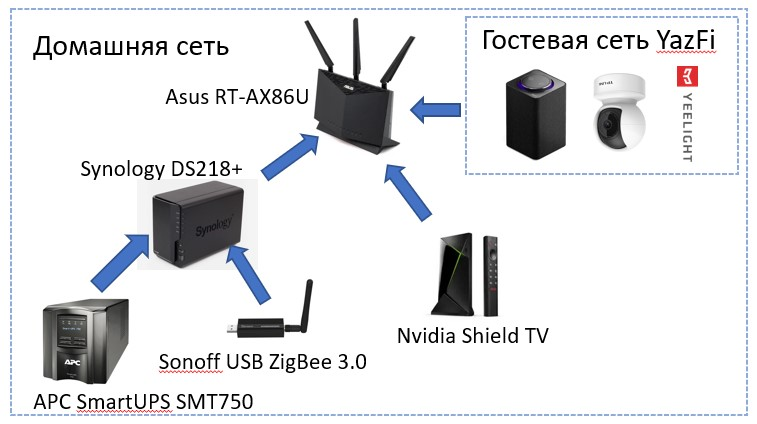
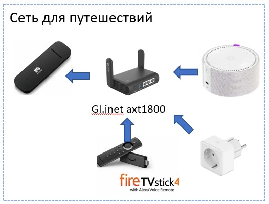
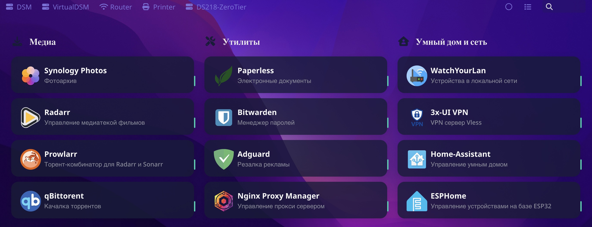

# "Live smart!" (c) Smeshariki

**[English](#english)** | **[Русский](#russian)**

---

## English

### Goals

My smart home solves the following tasks:

1. Stable and fast internet for everyone, including a 10 Gbps link to the NAS and 2.5 Gbps to the desktop.
2. Separate networks for guests, smart devices with internet-only access, internet + LAN, and LAN-only.
3. Local movies and TV shows with maximum convenience and quality for everyone in the family.
4. Family photo archive with maximum convenience and mandatory backups of phone gallery and the full collection. Limited access to the photo archive from public networks.
5. Family document workflow — printing, scanning, indexing, reliable storage and search across all documents and paper correspondence.
6. Voice or presence-driven control of lighting and other smart devices. Whenever possible, priority goes to local control with minimal cloud.
7. External access via VPN for the family, plus sharing my internet with external users to bypass restrictions.
8. Password vault for the whole family with secure access and integrations on most devices.
9. Ad-blocking, mostly for smart devices — TV, game consoles, etc.
10. Parental control for kids' internet access and specific services (TikTok, YouTube, etc.).
11. Occasionally a webserver exposed to the internet for niche tasks.

### Hardware

#### NAS as the home server

The core of my smart home is a Synology DS723+. All NAS-specific details are in a [dedicated section](https://github.com/ageev/SmartHome/blob/master/SynologyNAS/README.md).
I spent a long time picking a home server platform and settled on Synology. Why? Mainly reliability and low power draw. Downsides: it's a closed ecosystem, not open source. And Synology locks it down a bit more every year.

#### Router

There's a custom Merlin firmware for ASUS routers. Only fairly recent models get the interesting features though. More in the [ASUS Router](ASUS%20Router/README.MD) folder.
Still, I can't recommend ASUS. It's burned a lot of nerves, the UI is stuck in the 2000s, and there are workarounds everywhere — though the community is alive and the workarounds keep coming.

#### 10 Gbps

I have 10 Gbps inbound and outbound. Actually using that bandwidth is non-trivial:

- 10 Gbps runs hot. Most SFP+ modules heat up to 70°C, which raises ambient temps in enclosed spaces. Be ready to keep chasing the cat off the router. Synology's 10 Gbps add-on card heats my NAS drives by at least 2°C.
- Picking a media converter and/or SFP+ module compatible with both your ISP and your router is tricky. There's a high chance something will turn out to be incompatible.
- Not every router can really push 10 Gbps under all conditions. Just having the port doesn't mean much. Even if you think your router can't do it (iperf3 only shows a couple of gigabits), the problem might be the measurement, not the router: ASUS's built-in speed test, iperf3 on the router, iperf3 in a docker container on the NAS — none of them show me anything close to 10 Gbps. Only iperf3 from Synology's SynoCli Monitor Tools community package shows the real speed, and even then not always (sometimes the other end throttles).
- Not every "10 Gbps" cable actually delivers 10 Gbps. The longer the cable, the higher the chance of packet errors. A thicker cable doesn't necessarily mean faster. Trial and error (plus testing on short distances) is the only way. Branded patch cords don't always fit through wall holes either, so use fiber where you can. If the cables are already in the walls (like mine), angled network connectors are a great find.
- 10 Gbps runs from the router to the NAS. Other clients get 2.5/1 Gbps. Whether the NAS actually uses those 10 Gbps is debatable, but 2.5 Gbps from NAS to desktop is noticeably helpful.

#### On the road

When we're going somewhere for a while, I bring a "smart home lite" with me.

Plugging my own router into a hotel network is convenient. No need to reconnect tablets/phones/laptops to a new WiFi — the home network is already configured on the router. Fast WiFi plus a built-in VPN back home (e.g. to download a movie). A mini Alice (with USB-C!) and a smart plug let you turn off the lights without getting off the couch — a great option after walking around all day.
A Huawei modem, even one with hacked firmware, is mediocre at best. Eventually I'll upgrade to an external case + a miniPCI WAN card (great thread on 4pda about [this](https://4pda.to/forum/index.php?showtopic=994474)).
GL.iNet routers are excellent if you need mobility. Convenient UI with ad-blocking plus OpenWRT under the hood.
The Amazon Fire TV 4K Pro is the best stick — dirt cheap on sale. You can strip out all the Amazon junk (see @amazonfiretvrus on Telegram), install [FLauncher](https://gitlab.com/flauncher/flauncher), [SmartTubeNext](https://github.com/yuliskov/SmartTubeNext), [AerialView](https://github.com/theothernt/AerialViews), NUM (No UI Movies), and Kodi.

### Software

That's the Homer home dashboard (more on it below).
Running on the NAS:

- [Docker](https://github.com/ageev/SmartHome/blob/master/docker/README.MD) — all the important stuff lives here.
- Synology software:
  - **Synology Photos** — great catalog for family photos. I tidy up the family archive with [scripts](https://github.com/ageev/others) from time to time.
  - **HyperBackup** — universal backup tool. Works with practically every cloud and has very flexible policies. I back up a lot and often, mostly to Azure, encrypted thoroughly first.
  - **CloudSync** — syncs a local NAS folder with some cloud.
  - **Virtual Machine Manager** — runs VirtualDSM (a virtual NAS) and Home Assistant OS.
  - **Surveillance Station** — excellent CCTV manager.
  - The NAS shares the `Media` folder over the home network with downloaded movies.
- Python scripts that I run via the Synology task scheduler. The set changes over time. Currently:
  - Scripts for [photo handling]().
  - Scripts from [007revad](https://github.com/007revad) for the NAS:
    - enable HEIC support in Synology Photos (`Video_Station_for_DSM_722`)
    - move all apps to SSD (`syno_app_mover`)
    - add my actual HDDs/SSDs to Synology's "officially supported" list to bypass the vendor lock-in (`syno_hdd_db`)
    - clean docker garbage (`syno_docker_cleanup`)
  - "Sniper" scripts that I write whenever I need to monitor something.
  - A script that updates ["developer mode"](https://github.com/webosbrew/dev-manager-desktop) on LG TVs so I can sideload my own APKs.

---

## Русский

### Задачи

Мой умный дом решает следующие задачи:

1. Стабильный и быстрый интернет для всех пользователей, в том числе 10 Гбс канал до НАСа и 2.5 до компьютера.
2. Отдельные сети для гостей, умных устройств с доступом только к интернету, к интернету и домашней сети, только к домашней сети.
3. Локальные киношки и сериальчики с максимальным удобством и качеством для всех желающих.
4. Семейный фотоархив с макс. удобством и обязательным бэкапом фоток с гаджетов и всей коллекции. Ограниченный доступ к фотоархиву из публичных сетей.
5. Семейный документооборот — печать, сканирование, индексирование, надежное хранение и поиск по всем документам и бумажной переписке.
6. Управление с помощью голоса либо присутствия светом и другими умными устройствами. Приоритет всегда где возможно отдается локальному доступу с минимумом облачных технологий.
7. Внешний доступ через ВПН для семьи + шаринг моего интернета с внешними пользователями для обхода ограничений.
8. Хранилище паролей для всей семьи с возможностью безопасного доступа и интеграциями с большинством устройств.
9. Резалка рекламы, в основном, для умных устройств — телевизора, игровых приставок и т. д.
10. Контроль детского доступа к интернету и отдельным сервисам (ТикТок, Ютюб и т. д.).
11. Иногда вебсервер с доступом из интернета для каких-то нишевых задач.

### Железо

#### NAS в качестве домашнего сервера

Основа моего умного дома — NAS Synology DS723+. Все детали про свой НАС я вынес в [отдельный раздел](https://github.com/ageev/SmartHome/blob/master/SynologyNAS/README.md).
Я долго думал о платформе для домашнего дома и всё-таки остановился на Synology. Почему? Главным образом из-за надежности и низкого энергопотребления. Из минусов — это замкнутая система, не опенсорс. И Synology с каждым годом замыкает её всё сильнее.

#### Роутер

На роутеры АСУС существует кастомная прошивка от Merlin. Однако только свежие модели получают интересные фичи. Подробней смотри в папке [ASUS Router](ASUS%20Router/README.MD).
И всё же я не могу порекомендовать АСУС. У меня много нервов на него ушло, интерфейс «застрял в двухтысячных», и там и тут нужны костыли, хотя коммунити живёт и костыли исправно выходят.

#### 10 Гбит/с

У меня входящий и исходящий интернет канал — 10 Гб/с. Сколько-нибудь эффективно использовать такой канал непросто.

- 10 Гб/с — это горячо. Большинство SFP+ модулей прогреваются до 70 градусов, из-за чего в замкнутых пространствах растёт температура. Так что готовьтесь постоянно прогонять кота с роутера. Карта расширения 10 Гб/с от Synology прогревает жесткие диски моего НАСа, как минимум, на 2 градуса.
- Есть сложности с выбором медиаконвертера и/или SFP+ модуля, подходящего под вашего провайдера и ваш роутер. Есть высокий шанс, что что-то в итоге окажется несовместимым.
- Не все роутеры тянут 10 Гб/с и не при всех условиях. Наличие нужного порта ещё ничего не значит. Даже если вы думаете, что ваш роутер не тянет (iperf3 выдает всего пару гигабит), проблема может быть не в роутере, а в способе измерения: ни встроенный измеритель скорости Asus, ни iperf3 установленный на роутере, ни iperf3 запущенный в докер контейнере на НАСе не показывают мне ничего близкого к 10 Гб/с. Только iPerf3 из состава community-пакета Synology SynoCli Monitor Tools показывает правильную скорость, да и то не всегда (иногда сервер на той стороне может так же резать скорость).
- Не все 10 Гб/с кабеля дают 10 Гб/с скорость. Чем длиннее кабель — тем более вероятно, что пакеты будут прилетать с ошибками. Не факт, что толстый кабель даст большую скорость. Только методом проб и ошибок (а так же тестом на коротких расстояниях) можно найти нужный кабель. К тому же брендовые патчкорды не всегда пролезут в дырки, так что где можно используйте оптику. Если кабеля уже проложены в стенах (как у меня), то открытием оказались угловые коннекторы (angled network cable).
- 10 Гб/с у меня идёт от роутера до НАСа. Остальные клиенты получают 2.5/1 Gbps. Насколько НАС использует эти 10 Gbps, конечно, большой вопрос, но вот 2.5 Gbps от НАСа до стационарного компьютера заметно помогают.

#### В путешествиях

Когда мы надолго куда-нибудь уезжаем, я беру с собой «умный дом лайт».

Воткнуть свой роутер в сеть отеля — это удобно. Не нужно подключать планшеты/телефоны/ноутбуки к новому вайфаю, т. к. на роутере настроена домашняя сеть. Быстрый вайфай + встроенный ВПН до дома чтобы, например, скачать кино. Мини Алиса (с USB-C!) и умная розетка позволяют выключать свет не вставая с дивана (супер опция для тех, кто проходил весь день).
Модем Huawei, даже прошитый хакнутой прошивкой — опция так себе. Как-нибудь проапгрейжу до внешнего кейса + miniPCI WAN карты (на 4pda отличная тема про [это](https://4pda.to/forum/index.php?showtopic=994474)).
Роутеры GL.iNet — прям отличные устройства, если нужна мобильность! Удобный интерфейс с резалкой рекламы + OpenWRT внутри.
Amazon Fire TV 4K Pro — лучший стик, на распродаже оч дёшев. Можно убрать всё гавно от Амазона (см. @amazonfiretvrus в телеге), поставить [FLauncher](https://gitlab.com/flauncher/flauncher), [SmartTubeNext](https://github.com/yuliskov/SmartTubeNext), [AerialView](https://github.com/theothernt/AerialViews), NUM — No UI Movies и Kodi.

### Софт

Вот так выглядит домашний веб сервер Homer (ниже про него подробней).
На НАСе крутятся:

- [Docker](https://github.com/ageev/SmartHome/blob/master/docker/README.MD) — всё самое важное крутится тут.
- Софт Synology:
  - **Synology Photos** — отличный каталогизатор семейных фотографий. Я немного причесываю семейный архив [скриптами](https://github.com/ageev/others) время от времени.
  - **HyperBackup** — универсальный бэкапер. Работает практически со всеми облаками и имеет очень гибкие политики бэкапа. Я бэкаплю много и часто, в основном, в Azure, предварительно всё хорошенько зашифровав.
  - **CloudSync** — синхронизирует локальную папку на НАСе с каким-нибудь облаком.
  - **Virtual Machine Manager** — тут у меня крутится VirtualDSM (виртуальный НАС) и Home Assistant OS.
  - **Surveillance Station** — отличный менеджер камер наблюдения.
  - НАС шарит папку Media со всей домашней сетью, где лежат скачанные фильмы.
- Python скрипты, которые я запускаю через планировщик Synology. Их состав меняется со временем. Сейчас такой:
  - Скрипты для [работы с фото]().
  - Скрипты от [007revad](https://github.com/007revad) для работы с НАСом:
    - для включения поддержки HEIC в Synology Photos (`Video_Station_for_DSM_722`)
    - для перемещения всех приложений на SSD (`syno_app_mover`)
    - для добавления используемых жестких дисков и ССД в список «официально поддерживаемых дисков» Synology чтобы обойти вендорлок (`syno_hdd_db`)
    - для удаления мусора из докера (`syno_docker_cleanup`)
  - Скрипты-снайперы, которые я пишу когда мне нужно что-то отслеживать.
  - Скрипт для обновления [«режима разработчика»](https://github.com/webosbrew/dev-manager-desktop) на телевизорах LG чтоб можно было запускать свои apk файлы.
